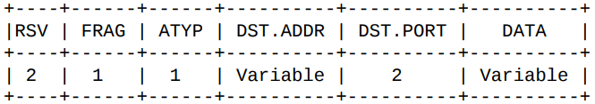

# RFC 1928 - SOCKS 5 协议中文文档「译」

## 文档状态
 本文档记录了一个由社区讨论制定的标准协议，大家可以对此文档提出改进的意见和建议。如果要讨论标准协议，记得标注一下当前的协议版本和状态。传播或者发布这份文档没有任何限制。

## 背景
这份文档描述的协议是对此协议第 4 版 （socks 4）的改进。这个新协议源自社区积极的讨论和原型的实现。主要贡献者有： Marcus Leech: Bell-Northern Research, David Koblas:Independent Consultant, Ying-Da Lee: NEC Systems Laboratory, LaMont Jones: Hewlett-Packard Company, Ron Kuris: Unify Corporation, Matt Ganis: International Business Machines.

## 1、简介
在因特网越来越普及的时候，防火墙的使用使得系统能轻易地将组织的内部网络结构与外部网络隔离。一般来说，防火墙充当了网络间的应用层网关的角色，提供受管制的 TELNET 、 FTP 和 SMTP 访问权限。为了更方便的信息沟通，越来越多的复杂的应用层网络协议被设计出来，人们迫切需要一个辅助这些协议安全又透明地穿透防火墙的工具。

同时，一种可行且强有力的（细粒度）认证也很重要。许多部门、复杂的组织关系，他们的网络需要合理地控制和强有力的认证，从这点不难看出这个要求的必要性。

这份文档描述的框架，使得客户端-服务端（C/S）结构的软件可以方便又安全的使用网络防火墙提供的服务，不管是 TCP 还是 UDP 域。从概念上讲，这个协议更像是应用层和传输层之前的“垫片层”，所以不能提供网络层的网关服务，例如传递 ICMP 报文。
## 2、实践总结
SOCKS 协议第 4 版本为基于 TCP 协议的 C/S 应用，包括 TELNET, FTP 和 使用广泛的信息发现协议如 HTTP 、 WAIS 提供了不保证安全性的防火墙穿透服务。

本新协议扩展了第 4 版本，加入了 UDP 协议支持，在框架上加入了强认证功能，并且地址信息也加入了域名和 IPV6 的支持。

使用新协议需要重新编译或者链接 SOCKS 库，以便正确封装和使用。
## 3、TCP 客户端流程
```
除非特别说明，包结构图里面的十进制数字代表该字段的长度（字节数）。
给定的字段，必定要有确定的值，语法 X’hh‘ 代表该单字节字段的值。
‘Variable’ 代表该字段为可变长度，其长度要么由对应的关联字段标识（通常为一到两个字节），要么由数据类型确定。
```
当 TCP 客户端想要建立必须透过防火墙（取决于具体的情况）的连接时，客户端必须与合适的 SOCKS 服务建立连接。SOCKS 服务默认监听 1080 端口，如果连接成功，客户端需要与服务端协商认证方式并完成认证，之后便可以发送中继请求。SOCKS 服务端会执行请求，要么建立起合适的连接，要么拒绝请求。

客户端连接到 SOCKS 服务端，发送的协议版本与认证方法数据包格式：


| 版本   | 方法数目	 | 方法列表   |
| :-----| :----    | :----:    |
| 1     | 1        | 1 to 255  |


VER （版本）字段在此版本中设置为 X’05‘ ， NMETHODS （方法数目）字段包含了 METHODS （方法列表）中所包含的方法识别码的个数。服务端要从给定的方法列表中选择一个方法并返回选择报文：


|  版本   | 方法  |
|  ----  | ----     |
| 1      | 1        |     

如果 METHOD （方法）字段为 X’FF‘， 表示方法列表中的所有方法均不可用，客户端收到此信息必须关闭连接。

目前已定义方法如下：

- X '00'　　无需认证
- X '01'　　GSSAPI
- X '02'　　用户名/密码
- X '03'　到　X’7F’　　IANA 指定
- X '80'　到　X’FE’　　为私有方法保留
- X 'FF'　　无可接受方法

随后，客户端与服务端开始协商该方法对应的后续认证，后续认证方法因方法而异，在其单独的文档里面进行描述。

为本协议开发新方法的开发者需要到 IANA 申请一个方法编号。被授予编号的方法的对应文档，会在列出方法编号列表、对应协议版本的文档中呈现。
## 4、请求
一旦认证方法对应的协商完成，客户端就可以发送请求细节了。如果认证方法为了完整性或者可信性的校验，需要对后续请求报文进行封装，则后续请求报文都要按照对应规定进行封装。

SOCKS 请求为如下格式：


字段含义：
- VER　协议版本： X‘05’
- CMD　命令
- CONNECT　连接， X‘01’
- BIND　监听X‘02’
- UDP ASSOCIATE　UDP关联 X‘03’
- RSV　保留字段
- ATYP　地址类型
- IPV4　X‘01’
- 域名　X‘03’
- IPV6　X‘04’
- DST.ADDR　目标地址
- DST.PORT　目标端口 （网络字节序）
SOCKS 服务端会根据请求类型和源、目标地址，执行对应操作，并且返回对应的一个或多个报文信息。
## 5、地址
地址字段具体含义由地址类型字段（ ATYP ）决定，具体对应关系如下：

- X‘01’
 表明地址字段为一个 IPV4 地址，长度为 4 个字节
- X‘03’
 表明地址字段为一个（合法的）域名，且第一个字节为域名长度标识，（显然）其不以 NULL 作为结束标识
- X‘04’
表明地址字段为一个 IPV6 地址，长度为 16 个字节

##6、回复报文

客户端与服务端建立连接并完成认证之后就会发送请求信息，服务端执行对应请求并返回如下格式的报文：


字段细节:

```
VER协议版本：　X‘05’
REP 回复字段（回复类型）：
    X‘00’　成功
    X‘01’　常规 SOCKS 服务故障
    X‘02’　规则不允许的连接
    X‘03’　网络不可达
    X‘04’　主机无法访问
    X‘05’　拒绝连接
    X‘06’　连接超时
    X‘07’　不支持的命令
    X‘08’　不支持的地址类型
    X‘09’　到　X’FF’　未定义
RSV　保留字段
ATYP　地址类型
    IPV4　X‘01’
    域名　X‘03’
    IPV6　X‘04’
BND.ADDR　服务端绑定地址
BND.PORT　服务端绑定端口 （网络字节序）
```
其中，标记为保留字段（ RSV ）的值必须设定为 X‘00’ 。

如果协商的方法为了完整性、可信性的校验需要封装数据包，则返回的数据包也会进行对应的封装。
#### 6.1、连接 （CONNECT）
对于连接请求，返回的报文里面 BND.PORT 为服务端用来连接目标地址所使用的端口，而 BND.ADDR 则包含了对应的 IP 地址。返回的 BND.ADDR 的值（ IP 地址）一般与客户端连接的 SOCKS 服务端地址不同，因为此类服务往往是多台机器提供服务。 SOCKS 服务端会使用目标地址、端口和客户端源地址、源端口信息来执行连接请求（建立对应关系）。

#### 6.2、绑定 （BIND）
绑定请求常在某些协议需要客户端接受来自服务端的连接的时候会用到，比较知名的如 FTP 协议，通过 客户端 -> 服务端 连接执行命令和状态同步，通过 服务端 -> 客户端 进行数据传输（例如： LS, GET, PUT ）。

应用协议客户端应当在通过连接命令建立主要连接后，再通过绑定命令建立第二个连接。 SOCKS 服务端应当根据 DST.ADDR 和 DST.PORT 来执行绑定命令。

一个绑定命令操作会对应两条 SOCKS 服务端 -> SOCKS 客户端 的返回报文。第一个报文会在建立 socket 监听后返回，这条报文 BND.PORT 字段包含了等待外部连接所监听的端口， BND.ADDR 字段包含了对应的 IP 地址。应用协议客户端应当使用这些信息让应用协议服务端去建立连接（通过第一步建立的主要连接/控制连接）。第二个报文会在预期的外部连接成功或失败后返回。

在第二个返回报文中， BND.PORT 和 BND.ADDR 为请求连接的外部主机地址与端口。

#### 6.3、UDP 关联 （UDP ASSOCIATE）
UDP 关联操作是用来与 UDP 中继程序建立 UDP 报文的关联关系。 DST.ADDR 和 DST.PORT 字段包含了客户端想要用来关联并发送 UDP 报文的地址与端口。服务端可利用此信息在关联中施加访问控制。如果客户端在建立关联时，这些信息都不具备所有权，则端口和地址字段所有字节应当全部设置为 X‘00’ 。

UDP 关联会在其对应的发送 UDP 关联请求的 TCP 连接结束的时候结束。

UDP 关联的回复报文中， BND.PORT 和 BND.ADDR 包含了客户端发送中继 UDP 数据包时所对应的地址与端口。

#### 6.4、回复处理
当回复报文表明请求失败时（ REP 字段为非 X‘00’ ）， SOCKS 服务端必须在发送该返回报文后及时关闭 TCP 连接。整个过程应当在确认当前状态的确发生故障后的 10s 内完成。

如果返回报文表明请求成功 （ REP 字段为 X‘00’ ）且对应的请求指令为绑定（ BIND ）或者连接（ CONNECT ），则客户端应当立刻开始进行数据传输。如果前面协商选择的方法为了完整性、认证和可信性的校验支持数据封装，则后续数据都应当使用对应的方法进行封装。类似的，当 SOCKS 服务端收到来自客户端的数据时，也要用该认证方法对应的方法进行数据处理。

## 7、基于 UDP 的客户端处理过程
基于 UDP 的客户端应当把 UDP 报文发送到 UDP 关联回复报文所指定的中继服务地址和端口。如果前面协商选择的方法为了完整性、认证和可信性的校验支持数据封装，则数据应当使用对应的方法进行封装。每个 UDP 报文都携带一个如下格式的请求头：

```
RSV　保留字段，应当置为 X‘0000’
FRAG　当前帧序号
ATYP　地址类型
    IPV4　X‘01’
    域名　X‘03’
    IPV6　X‘04’
DST.ADDR　目的地址
DST.PORT　目的端口
DATA　用户数据
```
当一个 UDP 中继服务决定中继一个 UDP 报文时，其是如此静默，不会给客户端任何反馈。类似地，不会或不能被中继的数据包会被丢弃。当中继服务收到了外部主机的 UDP 回复报文时，中继程序必须对应补充上述请求头，并按照协商的认证方法所对应的封装方法对数据进行封装。

中继服务必须接受，在前面 UDP 关联操作中，由 SOCKS 服务端回复的数据包中指定的客户端 IP 地址，所发送到 BND.PORT 所指定的端口的数据包。同时，必须丢弃其他不在关联记录中的源 IP 地址发送过来的数据包。

FRAG 字段表明了一个报文是否是一系列报文中的一个。如果有实现，则高位 bit 表明序列结束，而 X‘00’ 表明此报文为单独的报文。其他介于 1 至 127 的值表示该报文在其对应的报文序列中的位置。每一个接收者都有一个对应于每个序列的重新组装队列和计时器。每当计时器超时，或者接收到的帧序号小于当前队列已经接收到的最大帧序号，组装队列和对应的计时器都需要重新初始化。重新组装的计时器应当小于 5s 。建议能避免序列化为多帧就避免。

对于序列化帧的实现是可选的；如果一个实现不支持，则应当丢弃任何 FRAG 字段值不为 X‘00’ 的数据包。

支持 SOCKS 的 UDP 编程接口都必须报告可用的 UDP 数据报缓存空间，该空间必须小于系统提供的实际可用空间，报告格式如下：  
```
ATYP 说明
    X‘01’　　小于　10 （也与方法相关）　个字节
    X‘03’　　小于　262 （也与方法相关）　个字节
    X‘04’　　小于　20 （也与方法相关）　个字节
```
## 8、安全注意事项

本文档描述的是一个辅助应用层协议穿透 IP 网络防火墙的协议。此种方式的安全性高度依赖于客户端与服务端协商后选定的认证方法，以及该方法的具体实现中，所采用的认证方式和数据封装方式。

管理员应当仔细考虑选择哪种认证方式。